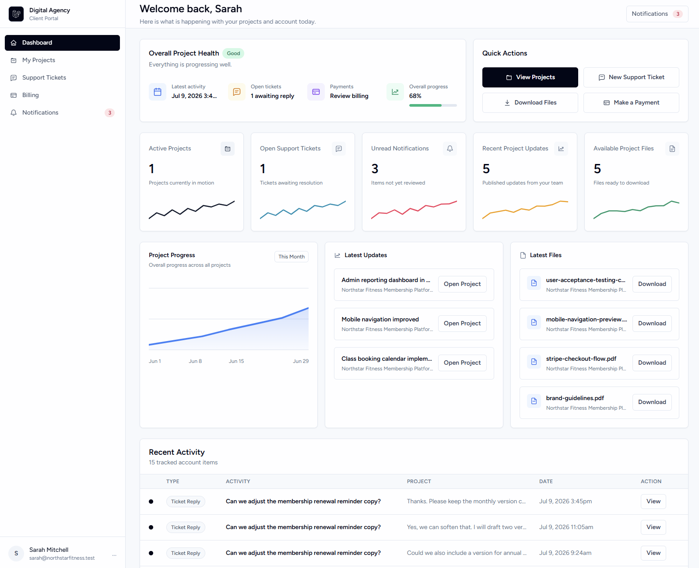

# Digital Agency Client Portal

A full-stack Laravel application that enables digital agencies to manage clients, projects, support tickets, billing, file sharing, and AI-powered project summaries through a secure client portal.

Built as a portfolio project to demonstrate production-style Laravel development, modern frontend architecture, testing, and business-focused software design.

<p align="center">
  
</p>

## Features

### Agency Admin (Filament)

- Authentication
- Role Based Access Control
- Client management
- Project management
- Project updates
- File uploads
- Support ticket management
- Payment request management
- User & role management
- Email notifications
- Role-based access control

### Client Portal

- Client dashboard
- Project progress tracking
- Activity timeline
- Download project files
- Support ticket system
- Billing & payment requests
- PDF invoice / receipt downloads
- Notifications
- AI-generated project summaries

## Technology Stack
- Laravel 12
- PHP 8.2+
- Vue 3
- Inertia.js
- Tailwind CSS
- Filament
- MySQL
- Spatie Permission
- Laravel Queues
- OpenAI / Ollama
- Stripe
- DomPDF
- Pest / PHPUnit

# Installation

```bash
git clone https://github.com/horacebenjamin/digital-agency-client-portal.git

cd digital-agency-client-portal

composer install

npm install

cp .env.example .env

php artisan key:generate

php artisan migrate:fresh --seed

npm run dev
```

## Demo Data

Reset and seed the database with realistic demo data:

```bash
php artisan migrate:fresh --seed
```

### Client Login

**Email:** `sarah@northstarfitness.test`  
**Password:** `password`

### Agency Admin Login

**Email:** `emma@agency.test`  
**Password:** `password`
